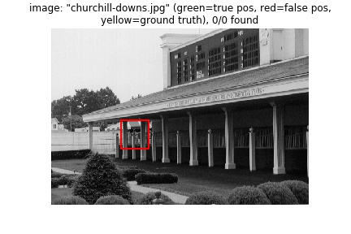
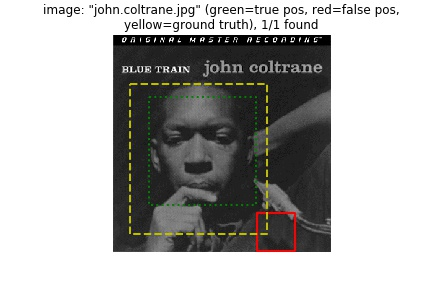
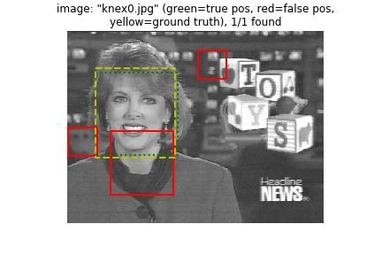
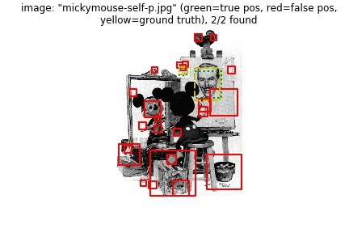
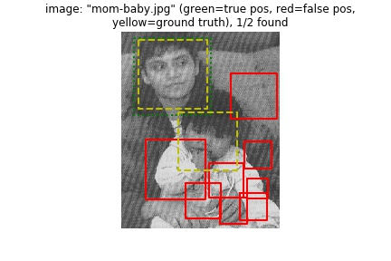
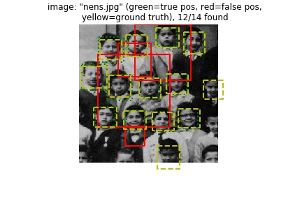
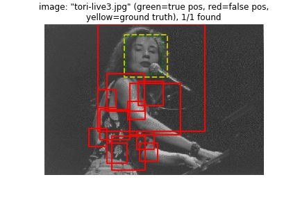
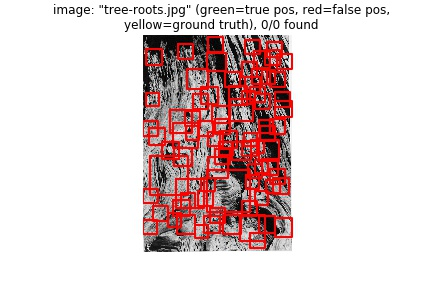
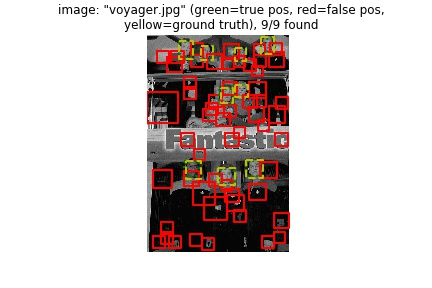

# 105061592 林鉉博
# Project 4 / Face Detection with a Sliding Window

## Overview
Handling heterogeneous training and testing data, training a linear classifier (a HoG template), and using classifier to classify millions of sliding windows at multiple scales.


## Implementation
##### get_positive_features.py  
- Load cropped positive trained images and extract HOG feature from training images.
    ```sh       
    filenames = glob.glob(train_path_pos+'/*.jpg')
    dim = (feature_params['template_size'] / feature_params['hog_cell_size'])**2 * 31

    features_pos = np.zeros(shape=(len(filenames), int(dim)))
    
    for idx in range(len(filenames)):
        img = imread(filenames[idx], as_grey=True)
        tmp = np.reshape(hog(img, feature_params['hog_cell_size']), (-1,))
        
        features_pos[idx] = tmp
    ```

##### get_random_negative_features.py
- Load images which has no faces(scenes).
- Convert them to HoG features.
- Get all the feature form no face which has no faces(scenes).
    ```sh
    random.seed()
    im_paths = glob(os.path.join(non_face_scn_path, '*jpg'))

    N = len(im_paths)
    D = int((feature_params['template_size']/feature_params['hog_cell_size'])**2 * 31)
    window = feature_params['template_size']
    features_neg = np.zeros([num_samples, D])
    im_pyramid = []

    # image pyramid
    print('Get negative images pyramid...')
    for idx in tqdm(range(N)):
        im = imread(im_paths[idx], as_grey=True)
        for (_, resized) in enumerate(pyramid_gaussian(im, downscale=feature_params['scale'])):
            if resized.shape[0] < window or resized.shape[1] < window:
                break
            im_pyramid.append(resized)

    # crop image features
    print('Get negative features...')
    for idx in tqdm(range(num_samples)):
        select = random.randint(0, len(im_pyramid)-1)
        im = im_pyramid[select].copy()
        h, w = im.shape
        crop_h = random.randint(0, h - window)
        crop_w = random.randint(0, w - window)
        features_neg[idx, :] = np.reshape(hog(im[crop_h:crop_h+window, crop_w:crop_w+window], feature_params['hog_cell_size']), D)
    ```
##### svm_classify.py
-  Train a linear classifier from the positive and negative examples(from get_positive_features.py and get_random_negative_features.py).
    ```sh
    clf = svm.LinearSVC(C=0.05)
    clf = calibration.CalibratedClassifierCV(clf, method='sigmoid', cv=5)
    clf.fit(x, y)
    ```
##### run_detector.py
- After the training classifier is completed, HOG feature (for each image size) is also taken for the test image during the test phase, after which the window for the feature is added for analysis, after which the trained classifier is used for classification.
- After the completion of classification, the information obtained iamge id, bounding boxes, confidence value packaged out to complete this program.
    ```sh
        cur_image_ids = np.zeros([0, 1])
        cur_bboxes = np.zeros([0, 4])
        cur_confidences = np.zeros([0, 1])
        ori_img = imread(test_scn_path+'/'+test_images[i], as_grey=True)

        
        for (sc_idx, im_pyramid) in enumerate(pyramid_gaussian(ori_img, downscale=feature_params['scale'])):
            if im_pyramid.shape[0] < window or im_pyramid.shape[1] < window:
                break
            scale =feature_params['scale']**sc_idx

            feats = hog(im_pyramid, cell_size)

            
            feats_num = (feats.shape[0]-cell_num+1) * (feats.shape[1]-cell_num+1)
            crop_feats = np.zeros([feats_num, cell_num, cell_num, 31])
            idx = 0
            for y in range(0, feats.shape[0]-cell_num+1):
                for x in range(0, feats.shape[1]-cell_num+1):
                    crop_feats[idx, :, :, :] = feats[y:y+cell_num, x:x+cell_num, :].copy()
                    idx = idx + 1
            crop_feats = np.reshape(crop_feats, [feats_num, D])

            conf = model.predict_proba(crop_feats)
            conf = conf[:, 1]

            conf_idx = np.argwhere(conf >= THRESH)
            if len(conf_idx) != 0:
                py_conf = conf[conf_idx]
                num_box = len(conf_idx)

                py_bboxes = np.zeros([num_box, 4])
                for idx in range(num_box):
                    cur_image_ids = np.concatenate([cur_image_ids, np.reshape(test_images[i],[1,1])], axis=0)
                    window_num = feats.shape[1]-cell_num+1
                    xstep = conf_idx[idx] % window_num
                    ystep = conf_idx[idx] // window_num

                    py_bboxes[idx, 1] = ystep * cell_size * scale
                    py_bboxes[idx, 0] = xstep * cell_size * scale
                    py_bboxes[idx, 3] = py_bboxes[idx, 1] + window * scale
                    py_bboxes[idx, 2] = py_bboxes[idx, 0] + window * scale

                cur_bboxes = np.concatenate([cur_bboxes, py_bboxes], axis=0)
                cur_confidences = np.concatenate([cur_confidences, py_conf], axis=0)


        is_maximum = non_max_supr_bbox(cur_bboxes, cur_confidences, ori_img.shape)

        cur_bboxes = cur_bboxes[is_maximum[:, 0], :]
        cur_confidences = cur_confidences[is_maximum[:, 0], :]
        cur_image_ids = cur_image_ids[is_maximum[:, 0]]

        bboxes = np.concatenate([bboxes, cur_bboxes], axis=0)
        confidences = np.concatenate([confidences, cur_confidences], axis=0)
        image_ids = np.concatenate([image_ids, cur_image_ids], axis=0)
    ```
# Result
### Cell size=3

<table border=1>
<tr>
<td>


</td>
</tr>

<tr>
<td>


</td>
</tr>

<tr>
<td>


</td>
</tr>

<tr>
<td>


</td>
</tr>

<tr>
<td>


</td>
</tr>


<tr>
<td>


</td>
</tr>


<tr>
<td>



</td>
</tr>


<tr>
<td>


</td>
</tr>


<tr>
<td>


</td>
</tr>

<tr>
<td>


</td>
</tr>

<tr>
<td>


</td>
</tr>


<tr>
<td>


</td>
</tr>


<tr>
<td>


</td>
</tr>

<tr>
<td>


</td>
</tr>


<tr>
<td>




</td>
</tr>

<tr>
<td>


</td>
</tr>

<tr>
<td>



</td>
</tr>


<tr>
<td>


</td>
</tr>


<tr>
<td>


</td>
</tr>

<tr>
<td>



</td>
</tr>

<tr>
<td>



</td>
</tr>

<tr>
<td>



</td>
</tr>

<tr>
<td>


</td>
</tr>

<tr>
<td>


</td>
</tr>

<tr>
<td>


</td>
</tr>

<tr>
<td>


</td>
</tr>

<tr>
<td>


</td>
</tr>

<tr>
<td>




</td>
</tr>

<tr>
<td>




</td>
</tr>

<tr>
<td>


</td>
</tr>

<tr>
<td>




</td>
</tr>

<tr>
<td>


</td>
</tr>

<tr>
<td>

</td>
</tr>
</table>


