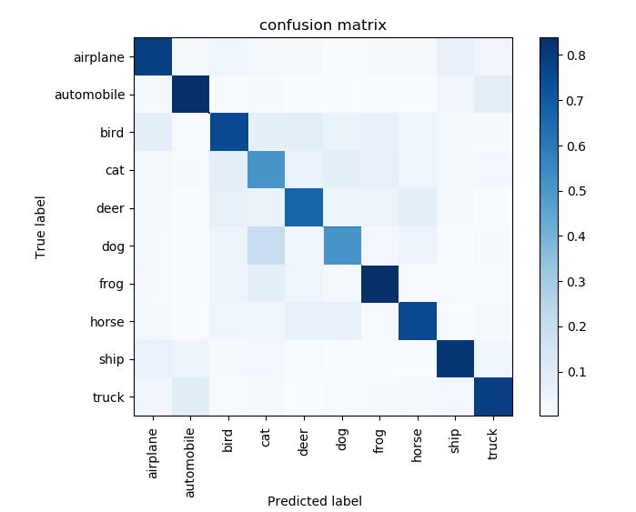

# 105061592 林鉉博
# Project 5: Deep Classification

## Overview
The project is related to implement simple classifier on the Cifar10 dataset, which consists 50000 training and 10000 testing images (32x32 color images) in 10 classes.

## Implementation
1. dataloader.py 
	* 32 x 32 images.
	
2. model.py
	* calculate training's data.
	
3. train.py
	* get training's data.
	
4. test.py

## Installation
* Tensorflow source code

### Results
  * accuracy = 89.045%
   
   

	
   

